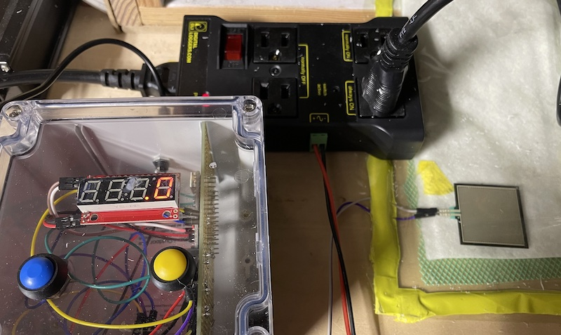
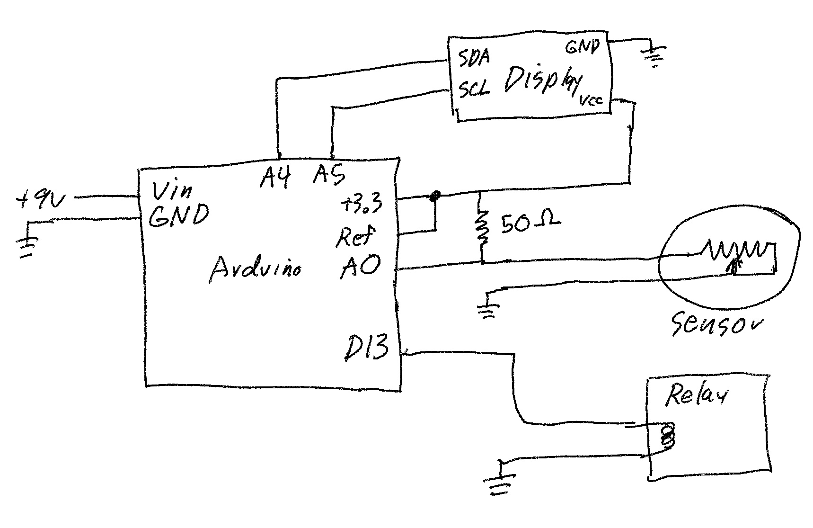
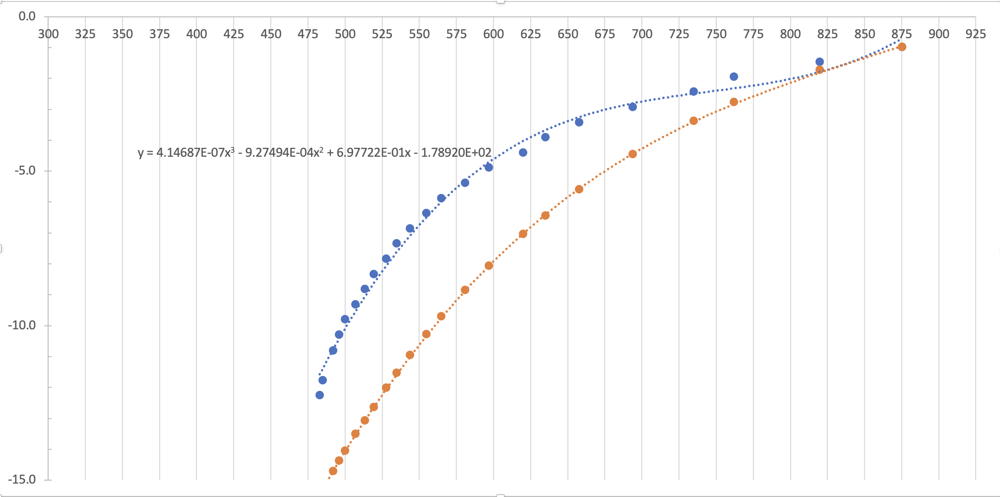

# vacuumCtrl

Pressure controller for vacuum pump and vacuum bagging 

## Overview

This controls turns a vacuum pump on and off to keep in an optimal range
for vacuum bagging carbon fiber parts. It works by putting a force
sensors in the vacuum bag. An Arduino reads the sensor readings and
controls a relay to turn the vacuum pump on and off. The controller can
also display the pressure.

## Usage

The controller will start the vacuum pump and let it run till the
pressure gets to -11 PSI then turn it off. Once the pressure comes back
up to -8 PSI, the pump again.The range can be changed by pressing the
blue an yellow buttons to set the upper and lower range respectively to
the current pressure. Holding a button down will cause the pump to
run. One can hold the yellow button down till the desired upper bound is
reached then hold the blue button down till the desired lower bound is
reached.

## Building

Parts:
* Force Sensor https://www.sparkfun.com/products/9376 $12
* Connector https://www.sparkfun.com/products/14194 $2
* Relay  https://www.sparkfun.com/products/14236  $30
* Arduino https://www.sparkfun.com/products/14236 $15
* Power https://www.sparkfun.com/products/15314 $6
* Display https://www.sparkfun.com/products/11441 $14
* Other: 50 Ohm resitor, two buttons, case, plugs and sockets, wire 

The display and buttons are optional.

Wiring up the parts is pretty simple.

Once it is build program it with the 

Hold both buttons down then power up the board with the buttons held
down. This will cause it to display raw values sensor values.

Use a vacuum gage to and pump to record the raw sensor value at
different vacuum level and enter that data into the spreadsheet at:

The spreadsheet will generate ca calibration forming on the graph that
can be used to update the "calib" function in the program. Update that
function, upload the new program, and you are done.

In the following graph, the blue is calibration data I measured and the
red is the theoretical values from the data sheet.

There is a substantial difference from what I measured and the data
sheet. Others users have found the same thing in other projects so the
data sheet may not be fully representative of what the part actually
does.

